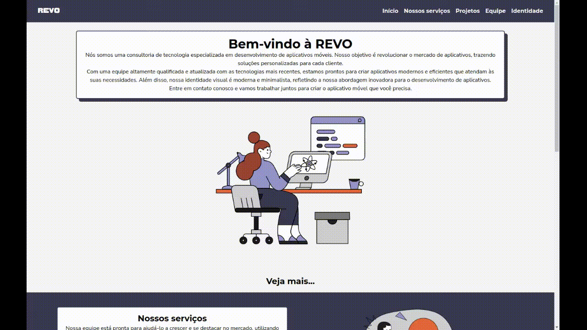

# 

  Feito com  

## O site

O site foi projetado em Mobile First, tendo seu layout totalmente responsivo e adaptado para diferentes tipos de dispositivos.

##### preview:

## Tecnologias utilizadas

 
 

Utilizamos o framework Astro para a criação do projeto, por ele ser baseado em HTML e a capacidade de integrar outros frameworks e bibliotecas.

O Tailwind foi usado para a estilização do site, por ser fácil para gerenciar o CSS das páginas. Ele é responsável por padronizar os elementos da página, com cores e estilo de fontes.

Já o React foi utilizado para a criação dos componentes funcionais, como o header responsivo. Por ser um componente isolado.
